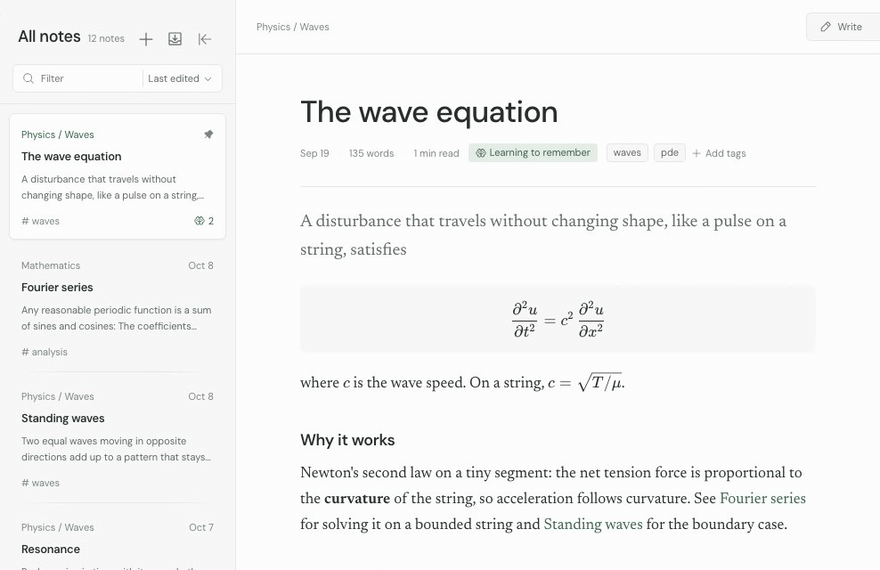
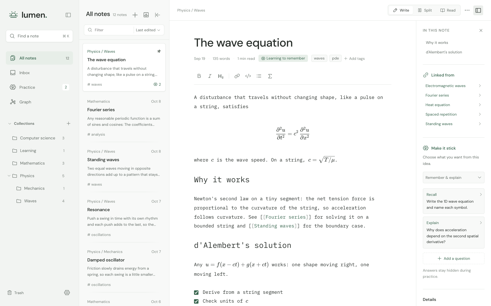
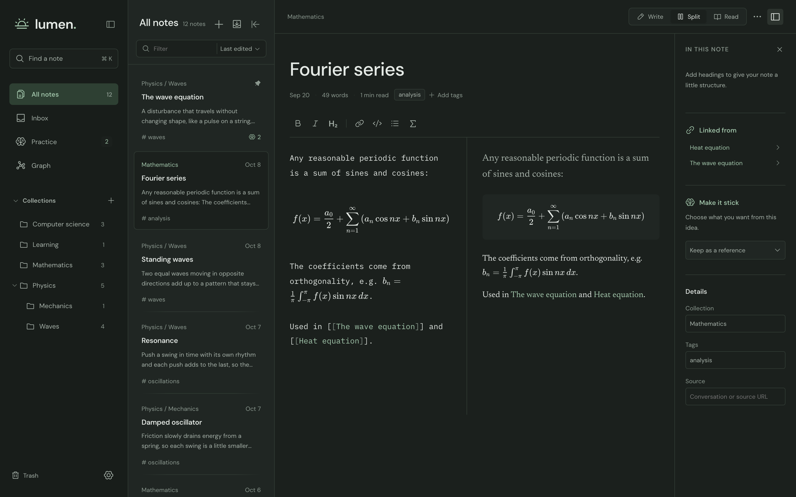
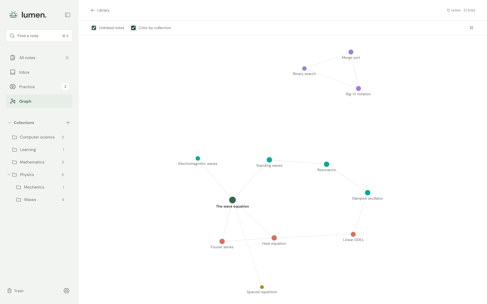
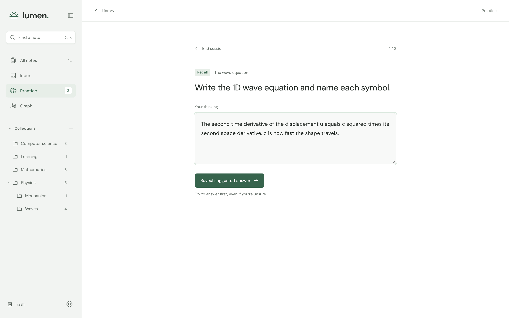

# Lumen

A Markdown editor and learning workbench powered by AI. Svelte 5, CodeMirror 6, KaTeX, and a Rust/Tauri 2 desktop shell. Plain Markdown files and SQLite keep your library local.



| Live Markdown and math                                                 | Split view, dark theme                                                           |
| ---------------------------------------------------------------------- | -------------------------------------------------------------------------------- |
|         |  |
| **Graph of linked notes**                                              | **Practice**                                                                     |
|  |              |

## Download

The latest build of `main`, rebuilt automatically after CI passes:

- macOS (universal, ad-hoc signed): [Lumen-macos-universal.dmg](https://github.com/varvand/lumen/releases/download/main-latest/Lumen-macos-universal.dmg). See [first launch](#sharing-a-macos-build-without-an-apple-developer-account) for opening an app that is not notarized.
- Linux (x86_64): [Lumen-linux-x86_64.AppImage](https://github.com/varvand/lumen/releases/download/main-latest/Lumen-linux-x86_64.AppImage) for most distributions (`chmod +x` it, then run it), or [Lumen-linux-amd64.deb](https://github.com/varvand/lumen/releases/download/main-latest/Lumen-linux-amd64.deb) for Debian and Ubuntu. Linux builds need WebKitGTK 4.1, which current distributions include.

Every version is also kept as a [tagged release](https://github.com/varvand/lumen/releases).

## Run

Requirements: Node.js 22.12+ (tested with Node 26), Rust 1.88+ (tested with 1.99), and the [Tauri platform prerequisites](https://v2.tauri.app/start/prerequisites/). On macOS, install Xcode command-line tools.

```sh
npm ci
npm run desktop
```

For the browser preview, run `npm run dev` and open http://127.0.0.1:1420. The preview uses browser localStorage, not your desktop library. It is explicitly labeled in the interface.

```sh
npm run check
npm test
npm run test:e2e   # Playwright against the browser preview; first run: npx playwright install chromium
cargo test --manifest-path src-tauri/Cargo.toml --no-default-features
npm run desktop:build
```

### Sharing a macOS build without an Apple Developer account

```sh
npm run desktop:release
```

This builds a universal (Apple silicon and Intel) app, signs it ad hoc, verifies the signature, and writes `src-tauri/target/universal-apple-darwin/release/bundle/dmg/Lumen_<version>_universal.dmg`. Ad-hoc signing needs no account, but the app is not notarized, so macOS cannot confirm who made it. On first launch, recipients:

1. Open the DMG and drag Lumen to Applications.
2. Open Lumen. macOS reports that it cannot verify the app; choose **Done**.
3. Open **System Settings → Privacy & Security**, scroll to Security, and choose **Open Anyway** for Lumen, then confirm.

After that, Lumen opens normally. Only share builds with people who trust you as the source. Removing the warning entirely requires a Developer ID certificate and notarization.

The local single-architecture app bundle from `npm run desktop:build` is written to `src-tauri/target/release/bundle/macos/Lumen.app`. Release distribution to other computers needs Apple signing and notarization. This project does not include signing credentials. The Rust core and frontend are portable; Windows and Linux builds need platform prerequisites and validation on those systems. Override bundle targets when building there, for example `npm run tauri build -- --bundles nsis` on Windows or `--bundles appimage,deb` on Linux.

### Updates

The desktop app updates itself from the rolling `main-latest` release, which CI rebuilds after every green push to `main`. Lumen checks `latest.json` on that release at launch and every six hours. When a newer build exists, an **Update available** button appears in the sidebar (and in Settings → Updates). Clicking it saves pending edits, downloads `Lumen.app.tar.gz`, verifies its signature, replaces the app, and relaunches. Nothing installs without that click. Development builds and the browser preview never check.

Every build of `main` is also published as a permanent release tagged `v<version>` (for example `v0.1.7`), with the macOS DMG, the Linux AppImage and .deb, their signed update files, and the commits since the previous version. The AppImage updates itself in place. A .deb install updates through the same button and asks for an administrator password (via `pkexec`) to install the new package. `main-latest` is a rolling pointer: its `latest.json` names the newest version and links to that tagged release's `Lumen.app.tar.gz`, and its DMG is a copy of the newest one.

CI versions each build of `main` as `<major>.<minor>.<run number>` from `tauri.conf.json` and the Main build workflow's run number, for example `0.1.42`. The updater installs a build only when the version in its signature matches the version `latest.json` announces, so the build number must be part of the app's real version. Because CI sets the patch number, bump the minor or major version in `tauri.conf.json` to mark a release. A manual patch bump has no effect. Run numbers restart at 1 if the workflow file is renamed or recreated, which would make new builds look older than installed ones; bump the minor version if that happens. Local builds keep the configured version (`0.1.0`), so they treat every CI build as newer.

Updates are signed with a minisign key, separate from Apple code signing. The public key is in `src-tauri/tauri.conf.json`. CI reads the private key and its password from the `TAURI_SIGNING_PRIVATE_KEY` and `TAURI_SIGNING_PRIVATE_KEY_PASSWORD` repository secrets. Keep an offline backup of the private key: if it is lost, installed apps reject every future update, and users must reinstall from a DMG once a new key is configured.

Install from the DMG into Applications before updating. An app run directly from the mounted DMG cannot replace itself.

## Included

- Markdown source editor with undo/redo, search, formatting shortcuts, and line wrapping.
- Reading, split, and focus views; light, dark, and system themes; adjustable reading typeface and size.
- Local rendering of `$inline$` and `$$display$$` LaTeX math, including aligned equations and matrices. This is math rendering, not a full `.tex` document compiler.
- Library search, collections, tags, pinning, a capture inbox, and recoverable Trash.
- `[[Links]]` between notes: type `[[` to pick a note title, click a link in the preview to open that note (or create it), and see "Linked from" notes in the details panel. Obsidian imports keep their links.
- A graph page that draws notes and their links. Drag notes, pan, zoom with the scroll wheel, and click a note to open it.
- PDFs beside your notes (desktop app): attach a PDF and it opens next to the note. Select text to quote it into the note with a link back to its page, such as `[[Lecture 4.pdf#page=12]]`. PDFs are kept as files in the library's `attachments` folder. Search and the graph can include the text of your PDFs, read on your computer; turn this off in Settings → Your library.
- Debounced autosave, flush on note changes and desktop close, atomic file replacement, and revision checks for conflicting saves.
- Markdown file import, paste capture, and export.
- Recall, explanation, and application questions with hidden suggested answers, self-assessed attempts, and adaptive review dates.
- One-click local MCP registration for ChatGPT desktop and Claude Desktop. Ask the chat app to send a conversation summary to Lumen's Inbox. See [connection setup](docs/chatgpt.md).

Collections can contain subfolders. Hover a folder and click its plus button to add one, or enter a path such as `Physics / Waves` when creating a collection. Parent folders include their descendants' notes; new notes stay in the folder you're viewing. Each new collection starts with a blank note. The sidebar, note list, details panel, and folder disclosure states are remembered on this device. In the collapsed sidebar, one Collections button opens the folder tree.

## Data

Default desktop locations:

- macOS: `~/Library/Application Support/app.lumen.desktop`
- Windows: the user's roaming application-data directory, under `app.lumen.desktop`
- Linux: the user's data directory (usually `~/.local/share`), under `app.lumen.desktop`

Set `LUMEN_LIBRARY` to an absolute directory path to use a separate library. The desktop process and MCP companion must use the same directory. Notes use stable identifiers as filenames in `notes/`; the first Markdown heading holds the human-readable title. SQLite stores collection metadata, practice questions, and attempts. Back up the entire library folder, preferably while the app and companion are closed. Do not delete the database if you want to retain practice history.

On window focus or a manual library refresh, Lumen reloads external edits to tracked Markdown files. Unsaved drafts are never replaced by an automatic refresh. If a conflicting edit is detected, export your draft before reloading. Import new Markdown files through the app; dropping untracked files directly into the data folder does not register them.

Trash marks notes as removed without deleting their Markdown or review history. Restore them in the Trash view. Notes from MCP are reference-only and arrive in Inbox; keeping a note and choosing a learning goal is explicit.

## Learning model

The learning activities are informed by research, but Lumen and its scheduling heuristic have not been experimentally validated. Ratings are self-assessments, not verified mastery. First successful reviews are scheduled in three days, effortful reviews in one day, and lapses in ten minutes. Later intervals expand according to the prior interval, with a 180-day cap. Each question is scheduled independently; recalling a definition does not mark an application problem as learned.

See [the evidence and evaluation plan](docs/learning-science.md). There are no claims about a guaranteed speedup.

## ChatGPT and privacy

Lumen makes no inference requests and requires no model API key. ChatGPT generates the summary in your existing conversation; the local MCP companion creates a Markdown note in Inbox. The app has no automatic chat-history access. The ChatGPT desktop connection runs entirely on the same computer and needs no tunnel or hosted Lumen service. Connect it in Settings, then restart the Lumen MCP server in ChatGPT to load the registration. Hosted conversations without local tool access use the manual Markdown workflow.

Fonts, editor, and math assets are bundled. Markdown HTML is sanitized before rendering. External links open only when activated. No analytics are included.

## Design

The interface uses a cool neutral palette and muted green, DM Sans for controls, Newsreader for documents, and IBM Plex Mono for source. The document serif serves a publication-like reading surface; controls remain sans serif. Motion is limited to short state transitions, with reduced-motion support.

Icons, including the application mark, are adapted from Phosphor Icons (MIT). Font packages retain their bundled licenses. See `assets/THIRD_PARTY.md`.
